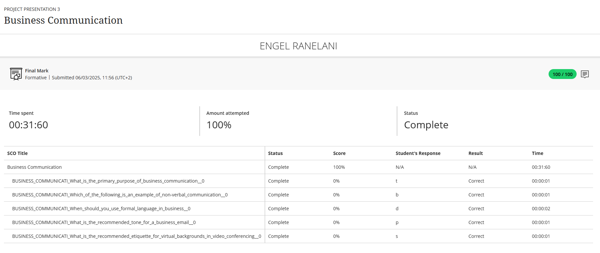

# 💼 Business Communication

## 🧾 Evidence

As part of my professional development module, I completed a formal assessment on Business Communication. This test was designed to evaluate my understanding of effective communication in a professional environment, covering written, verbal, and non-verbal techniques used in the workplace.

Below is the result from the Business Communication assessment, which confirms my grasp of these essential professional skills.

## ✍️ Reflection (STAR Technique)

**⭐ Situation:**
As part of my professional development, I completed a short course on Business Communication to improve my ability to communicate effectively in professional settings. This included lessons on workplace correspondence, report writing, and presentation skills.

**🎯 Task:**
My goal was to complete the course and its final assessment. I aimed to improve how I structure formal emails, deliver clear written communication, and maintain professionalism in all forms of workplace interaction.

**⚙️ Action:**
I engaged with all course modules and practice exercises, focusing on clarity, tone, and format when writing professional emails and reports. I reviewed the core principles of non-verbal cues and digital etiquette to prepare for the assessment.

**✅ Result:**
I successfully passed the assessment with a perfect score of 100/100. This result validated my understanding of the material and boosted my confidence. I now apply these skills in my internship when sending professional emails and communicating with colleagues, leading to clearer and more effective interactions.

**💡 Key Competencies Demonstrated:**
Professional Writing & Correspondence
Digital & Cross-Cultural Communication
Understanding of Professional Tone & Etiquette

> This assessment confirmed my ability to communicate clearly and professionally in different workplace contexts.

