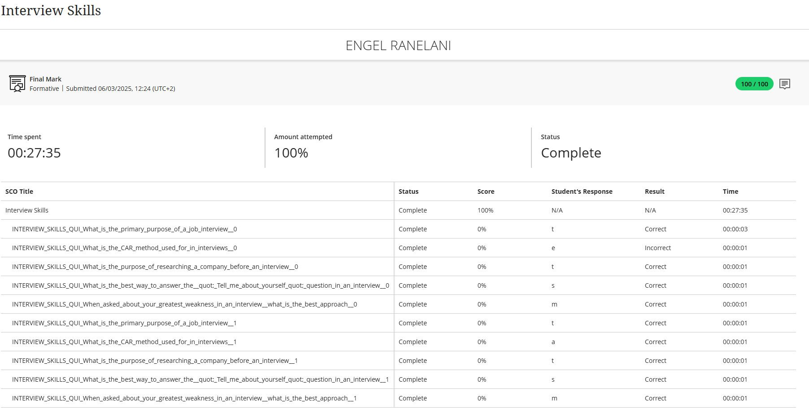

# Interview Skills

## 🧾 Evidence
To prepare for professional job applications, I completed a formal assessment on Interview Skills. This test evaluated my ability to prepare for and perform effectively in an interview setting, covering everything from structuring answers to demonstrating professional confidence.

Below is the result from the Interview Skills assessment, which confirms my readiness to articulate my qualifications and experience to potential employers.

## ✍️ Reflection (STAR Technique)

**⭐ Situation:**
In preparation for upcoming job applications, I undertook an Interview Skills course. The curriculum was designed to teach effective response strategies and build confidence for presenting myself professionally to employers.

**🎯 Task:**
My main objective was to master common interview formats and question types. I focused on learning how to structure compelling answers and develop practical strategies for handling challenging or unexpected questions.

**⚙️ Action:**
I actively studied various interview techniques, with a strong focus on practicing the STAR method for behavioral questions. I completed all practice assessments and reviewed the course material on professional etiquette, body language, and verbal communication to ensure I was fully prepared.

**✅ Result:**
Completing this course and its assessment has significantly improved my approach to interviews. I now have a clear framework for preparing key examples of my achievements and can communicate my skills with confidence and clarity. I feel far more self-assured and prepared for real-world job interviews.

**🎯 Core Skills Acquired:**
Strategic Storytelling (STAR Method)
Professional Presence & Delivery
Handling Behavioral & Technical Questions

>This training equipped me with the confidence and techniques to effectively articulate my value to potential employers.
