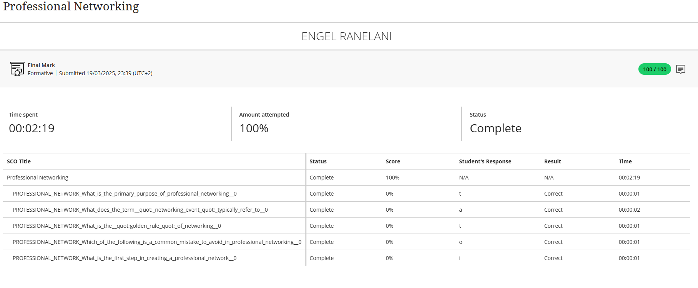

## Professional Networking

# 🧾 Evidence
A key component of my professional development involved building and maintaining a professional online presence. My LinkedIn profile serves as the primary evidence of this work, showcasing my skills, connections, and engagement within the ICT industry. It is an active and optimized platform for professional networking.

## ✍️ Reflection (STAR Technique)

**⭐ Situation:**
As part of our career readiness training, there was a strong emphasis on transitioning from an academic mindset to a professional one. A critical part of this was understanding that career opportunities often arise from a strong professional network, making platforms like LinkedIn essential tools for growth.

**🎯 Task:**
My objective was not merely to finish the course, but also to build a strategic professional presence online. The goals were to engage authentically with my network to build visibility and learn from others.

**⚙️ Action:**
I conducted a complete overhaul of my LinkedIn profile, writing a keyword-rich "About" section and detailing my technical projects with links to my GitHub. I strategically identified and sent personalized connection requests to alumni, recruiters, and senior professionals in software development. Furthermore, I was able to learn more about the importance of professional networking in my field of career.

**✅ Result:**
This focused effort has transformed my LinkedIn from a simple online resume into a dynamic networking tool. My network has grown significantly, and now includes a diverse range of industry contacts. More importantly, I have the important skill needed for networking in my field through learning in this course.

**💡 Key Competencies Developed:**    
-Professional Brand Management   
-Strategic Online Networking    
-Digital Communication & Etiquette

> This experience taught me that networking is not about collecting contacts, but about building genuine professional relationships and creating a community for learning and opportunity.
