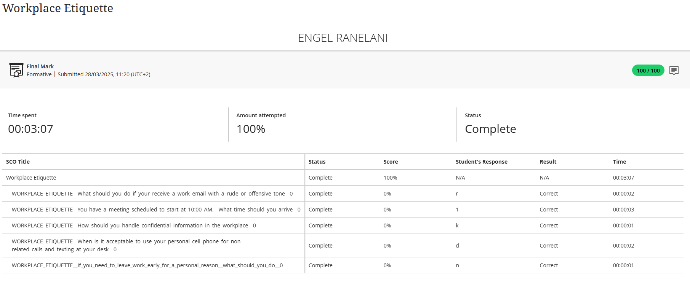

## 👔 Workplace Etiquette

# 🧾 Evidence

Understanding and practicing professional conduct is foundational to success in any work environment. I completed a formal assessment on Workplace Etiquette that covered critical scenarios, including professional communication, punctuality for meetings, handling of confidential information, and appropriate use of personal devices.

The result below confirms my comprehensive understanding of these principles.

# ✍️ Reflection (STAR Technique)

**⭐ Situation:**
Alongside my theoretical coursework, I am engaged in a 12-month internship, which provides a daily, practical arena to apply the principles of professional conduct. The Workplace Etiquette module was designed to provide a clear framework for the professional behaviors expected in this corporate environment.

**🎯 Task:**
My objective was to master the rules of professional etiquette and seamlessly integrate them into my daily actions during my internship. The goal was not just to pass an assessment, but to build a reputation as a reliable, respectful, and collaborative team member who contributes positively to the workplace culture.

**⚙️ Action:**
I actively studied the course material, paying close attention to the nuances of digital communication, conflict resolution, and ethical conduct. During my internship, I made a conscious effort to translate this knowledge into practice. For example, I consistently arrived 10-15 minutes early for meetings, managed sensitive information with discretion, and prioritized my work tasks over personal device use. I actively sought feedback from my supervisor on my professional conduct and made adjustments to ensure I was aligned with company expectations.

**✅ Result:**
My perfect score on the formal assessment validated my theoretical knowledge, and my consistent application of these principles during my internship has produced tangible outcomes. It has allowed me to build strong, positive relationships with colleagues and supervisors, who trust me with confidential tasks and value my contributions in team settings. This experience has proven that strong workplace etiquette is not just about politeness; it is a critical skill that builds credibility and fosters effective collaboration.

**💡 Key Competencies Demonstrated:**   
-Professional Decorum & Punctuality  
-Ethical Conduct & Confidentiality  
-Effective Interpersonal Communication  
-Adaptability in a Corporate Environment

 > This training and its practical application have been fundamental in shaping my professional identity and ensuring I can integrate smoothly and effectively into any team.
