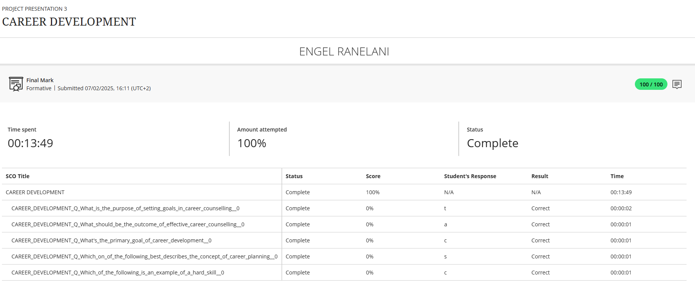

# 💼 Career Counselling

## 🧾 Evidence

During the Career Readiness Training module, I completed an interactive **Career Assessment Quiz**. This quiz helped analyze my personality traits, skills, and work preferences to recommend suitable ICT-related career paths.
Below is the result from the career assessment quiz I completed as part of the Career Readiness Training module:

## ✍️ Reflection (STAR Technique)

**Situation**:  
As part of the Career Readiness module, we were introduced to various activities designed to guide us in understanding our potential career paths. One of these was an online quiz that assessed our personality, values, and strengths.

**Task**:  
I had to complete the quiz and use the results to identify a career direction that best suits me, particularly in the ICT field.

**Action**:  
I engaged in the quiz, answered questions honestly about my interests, strengths, and work style, and reflected on the results. The assessment aligned me with roles in **software development** and **quality assurance**, which matched my growing interest in coding and testing.

**Result**:  
The outcome helped reinforce my decision to pursue software engineering and testing roles. It gave me confidence in my path and clarified the skills I should focus on developing further — including programming, analytical thinking, and communication.

---

🎯 **Career Direction Identified**:  
- Software Developer   
- Systems Analyst

> This activity helped shape my career vision by aligning my passion with real-world roles in ICT.
