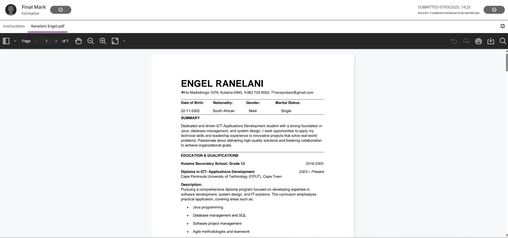

# 📬 CV Submission

## 🧾 Evidence

After completing my CV, I submitted it as part of the Career Readiness Training. The submission followed the provided guidelines for format, file naming, and structure.

📄 **[Download the Submitted CV](../assets/Engel_Ranelani_CV 2.pdf)**  
📸 CV Submission Proof:

---

## ✍️ Reflection (STAR Technique)

**Situation**:  
As the final part of the CV module, we were required to submit our completed CV through a formal platform (e.g., Blackboard or submission portal).

**Task**:  
Ensure my CV was submitted in the correct format, with a professional file name, and by the deadline.

**Action**:  
I followed all instructions from the module, renamed the file appropriately (`RanelaniEngel_CV.pdf`), and submitted it. I also captured a screenshot as proof of submission.

**Result**:  
The CV was successfully submitted. This experience helped me better understand how to professionally handle document preparation and digital submission processes — a vital skill for real-world job applications.

---

🎯 **What I Learned**:
- Submitting professional documentation on time  

