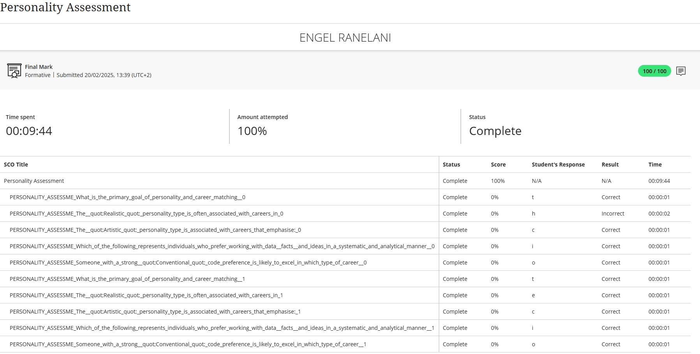

# 🧠 Personality Assessment

## 🧾 Evidence

As part of the Career Readiness Training, I completed a personality assessment module. The goal was to better understand my behavior, preferences, and how I respond in different situations — particularly in work or team environments.

This activity helped me see how my personality influences the way I solve problems, handle feedback, collaborate, and lead.

---

## ✍️ Reflection (STAR Technique)

**Situation**:  
The work readiness module required us to complete a personality quiz to help us better understand how we function in a team and professional setting.

**Task**:  
I had to reflect on my personality traits and understand how they affect my approach to learning, collaboration, and career preferences.

**Action**:  
I answered the personality quiz honestly and reviewed the outcome, which revealed that I am a supportive, detail-oriented, and logical thinker. It also showed I value collaboration and take initiative in structured environments.

**Result**:  
This helped me realize that I thrive in structured, team-driven roles — such as:
- Software Developer (collaborating with others on code)
- Project Coordinator (organizing tasks and teams)
- QA Tester (focusing on detail and consistency)

---

🎯 **Key Personality Traits Identified**:
- Logical and Analytical  
- Responsible and Reliable  
- Cooperative and Team-Oriented  
- Self-Motivated and Structured  

