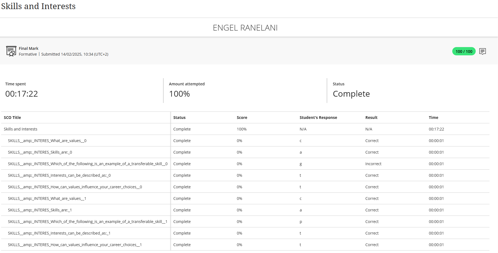

# 🛠️ Skills and Interests

## 🧾 Evidence

During the Career Readiness Training module, I completed a self-assessment quiz designed to help me identify my core skills, natural strengths, and personal interests.

This activity helped me understand the types of tasks and environments I enjoy most, and it gave me clarity on how those preferences match with real-world ICT roles.

---

## ✍️ Reflection (STAR Technique)

**Situation**:  
As part of the work readiness training, we were guided through a quiz aimed at discovering our strongest skills and what kind of work we enjoy doing the most.

**Task**:  
My task was to reflect on my interests and identify how they align with potential ICT career paths.

**Action**:  
I completed the quiz and reflected on the results, which highlighted my strengths in problem-solving, logical thinking, teamwork, and attention to detail.

**Result**:  
The quiz confirmed that I am well-suited for roles such as:
- Software Developer  
- Systems Analyst  
- Quality Assurance Tester  

This helped me narrow my focus toward careers that align with my personal motivation and academic strengths.

---

🎯 **Key Skills Identified**:  
- Analytical Thinking  
- Communication  
- Programming  
- Collaboration  
- Detail Orientation

